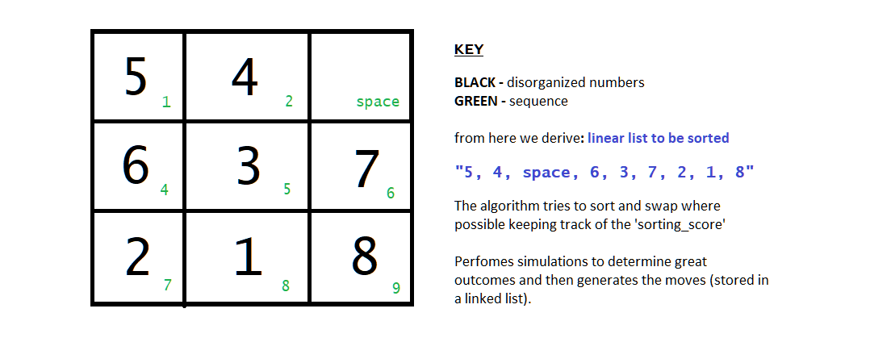

# NumPuzzleAlgorithm

Basic working summarized to:

Note:

-> Don't worry about Debug.py (it is just for generating debug logs in 'Debug.txt' incase of a problem)
-> Worry so much about "DetectPositions.py"

- Ian Wright
